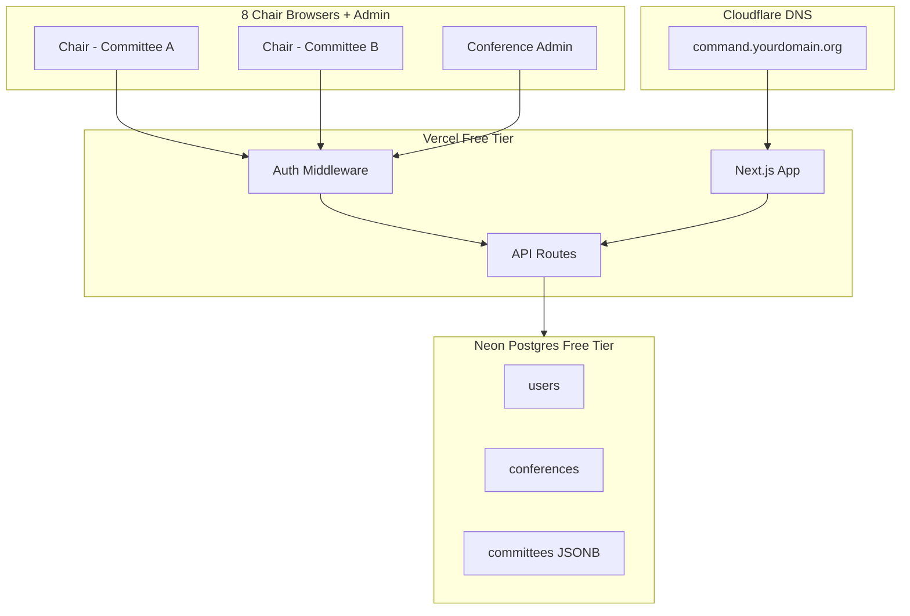
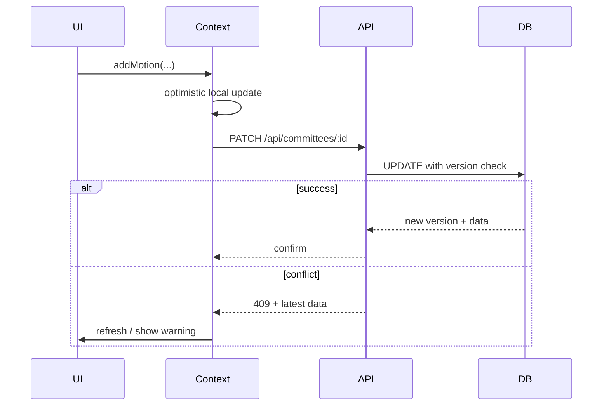

# Multi-User Deployment Plan

## Current State (Blockers)

The app in [`panthermunc-command`](panthermunc-command) is a **single-user, client-only** tool:

- All conference data lives in one browser's `localStorage` via [`src/lib/storage.ts`](panthermunc-command/src/lib/storage.ts)
- [`ConferenceContext.tsx`](panthermunc-command/src/context/ConferenceContext.tsx) mutates in-memory state and auto-saves locally
- The management password added recently ([`src/lib/password.ts`](panthermunc-command/src/lib/password.ts)) is client-side only and does not support per-user accounts
- [`CommitteeNav.tsx`](panthermunc-command/src/components/layout/CommitteeNav.tsx) lets any viewer switch between all committees

**8 concurrent chairs cannot share this architecture.** Deployment requires a backend database, login sessions, and committee-scoped authorization.

---

## Target Architecture



### Recommended stack (all free tier, ~$0/year for this use case)

| Layer | Choice | Why |
|-------|--------|-----|
| Hosting | **Vercel** (Hobby) | Native Next.js 16 support; HTTPS included |
| Database | **Neon** Postgres | 0.5 GB free; works with serverless; no credit card on free tier |
| Auth | **Auth.js v5** + `bcrypt` | Login sessions in httpOnly cookies; roles live in your DB |
| DNS | **Cloudflare** (already owned) | CNAME `command` → Vercel |

**Not recommended for v1:** Supabase Realtime, WebSockets, or a fully normalized schema. Eight users editing **different** committees is low conflict; keep migration cost low.

---

## Roles and Access Model

| Role | Login | Committee access | Settings / user mgmt | Exports |
|------|-------|------------------|----------------------|---------|
| **admin** | Yes | All committees (switch freely) | Full (`/settings` + new `/admin/users`) | All |
| **chair** | Yes | **Only assigned committee** (auto-selected, no switcher) | None | Own committee only |

- Replace the current client-side management password gate in [`src/app/settings/page.tsx`](panthermunc-command/src/app/settings/page.tsx) with **server-side admin role checks**
- Chairs never see "Manage Conference", "Add Committee", or other committees in the nav

---

## Data Model (Postgres)

Start with a **JSONB-per-committee** schema to minimize refactor of existing TypeScript types in [`src/lib/types.ts`](panthermunc-command/src/lib/types.ts):

```sql
conferences (
  id uuid PK,
  name text,
  year int,
  created_at, updated_at
)

users (
  id uuid PK,
  conference_id uuid FK,
  username text UNIQUE,
  password_hash text,
  role text CHECK (role IN ('admin', 'chair')),
  committee_id uuid FK NULL,  -- NULL for admin
  display_name text,
  created_at
)

committees (
  id uuid PK,
  conference_id uuid FK,
  name text,
  type text,
  topic text,
  data jsonb,        -- delegates, motions, rollCalls, scores, etc.
  version int,       -- optimistic concurrency
  updated_at
)
```

- `committees.data` stores everything currently nested under `Committee` **except** top-level `id/name/type/topic` (or store the full object — either works; pick one and keep it consistent)
- `version` increments on every write; reject stale PATCHes with `409 Conflict` so two tabs don't silently overwrite each other
- **Single conference per deployment** for v1 (one PantherMUNC weekend). Multi-conference tenancy can come later.

---

## API Surface (Next.js Route Handlers)

Add `src/app/api/` routes:

| Route | Auth | Purpose |
|-------|------|---------|
| `POST /api/auth/login` | Public | Credentials login (or use Auth.js built-in) |
| `POST /api/auth/logout` | Session | End session |
| `GET /api/conference` | Session | Conference metadata + committee list (scoped) |
| `GET /api/committees/[id]` | Session + committee scope | Load full committee data |
| `PATCH /api/committees/[id]` | Session + committee scope | Apply mutation (send `version`, get new `version`) |
| `POST /api/committees` | Admin only | Create committee |
| `DELETE /api/committees/[id]` | Admin only | Remove committee |
| `PATCH /api/conference` | Admin only | Edit name/year |
| `DELETE /api/conference` | Admin only | Delete entire conference |
| `GET/POST/DELETE /api/admin/users` | Admin only | Manage chair accounts |

**Authorization middleware** (`src/middleware.ts`):
- Redirect unauthenticated users to `/login`
- Attach `userId`, `role`, `committeeId` to request context
- Block chairs from any route/committee ID they don't own

---

## App Refactor (Biggest Code Change)

Replace the localStorage-centric flow in [`ConferenceContext.tsx`](panthermunc-command/src/context/ConferenceContext.tsx):



### Key changes by file

1. **[`ConferenceContext.tsx`](panthermunc-command/src/context/ConferenceContext.tsx)** — Load committee from API on mount; every mutation becomes `PATCH` instead of `setState` + `localStorage`. Keep optimistic UI updates for responsiveness.
2. **[`storage.ts`](panthermunc-command/src/lib/storage.ts)** — Demote to export/import utilities only (admin backup), not primary persistence.
3. **[`page.tsx`](panthermunc-command/src/app/page.tsx)** — Setup wizard becomes **admin-only** after initial bootstrap; chairs land directly on their committee workspace.
4. **[`CommitteeNav.tsx`](panthermunc-command/src/components/layout/CommitteeNav.tsx)** — Hide committee switcher for chairs; show only for admin.
5. **[`Header.tsx`](panthermunc-command/src/components/layout/Header.tsx)** — Hide admin actions (Add Committee, Manage Conference) from chairs.
6. **New `src/app/login/page.tsx`** — Username + password form.
7. **New `src/app/admin/users/page.tsx`** — Admin creates chair accounts: username, temp password, committee assignment.
8. **[`settings/page.tsx`](panthermunc-command/src/app/settings/page.tsx)** — Remove `PasswordGate` / `sessionStorage` unlock; gate with admin session server-side.

### Polling (v1 sync strategy)

- Chairs: no polling needed if they only edit their own committee
- Admin viewing another committee: **poll `GET /api/committees/[id]` every 10s** when admin has a committee selected (cheap, no extra services)
- Realtime (Supabase/Pusher) is a Phase 2 nice-to-have, not required for launch

---

## Bootstrap and User Onboarding Flow

**First deploy (one-time setup):**

1. Run DB migrations (Drizzle or Prisma — recommend **Drizzle** for lightweight SQL + free tier)
2. Seed initial admin from env vars: `BOOTSTRAP_ADMIN_USERNAME`, `BOOTSTRAP_ADMIN_PASSWORD`
3. Admin logs in → runs existing setup wizard (create conference + committees)
4. Admin goes to **User Management** → creates 8 chair accounts, each assigned to one committee
5. Share credentials with chairs (or admin sets passwords and distributes securely)

**Remove** management password from conference creation form — admin account *is* the gate.

---

## Deployment Steps (Ops)

1. **Neon** — Create project, copy `DATABASE_URL`
2. **Vercel** — Import GitHub repo, set env vars:
   - `DATABASE_URL`
   - `AUTH_SECRET` (random 32+ char string)
   - `AUTH_URL` = `https://command.yourdomain.org`
   - `BOOTSTRAP_ADMIN_USERNAME` / `BOOTSTRAP_ADMIN_PASSWORD`
3. **Cloudflare DNS** — Add CNAME record:
   - Name: `command` (or preferred subdomain)
   - Target: `cname.vercel-dns.com`
   - Proxy: DNS only (grey cloud) initially; orange cloud OK once SSL verified
4. **Vercel** — Add custom domain in project settings
5. Run migrations against production DB
6. Smoke test: admin login → create conference → create chair → chair login → verify isolation

---

## Security Essentials (Free, No Extra Services)

- Passwords hashed with **bcrypt** (cost 10–12) server-side only
- **httpOnly** session cookies; `Secure` + `SameSite=Lax` in production
- All mutations validated server-side (role + committee scope), never trust client
- Rate-limit login endpoint (simple in-memory or Vercel edge — 5 attempts / 15 min per IP)
- No secrets in client bundle or exported JSON backups

---

## Phased Implementation

### Phase 1 — Backend foundation (required before deploy)
- Add Drizzle + Neon, schema, migrations
- API routes for conference + committee CRUD
- Refactor `ConferenceContext` to use API instead of `localStorage`

### Phase 2 — Authentication and authorization
- Auth.js login/logout, middleware, `/login` page
- Role-based UI scoping (chair vs admin)
- Server-side guards on all API routes

### Phase 3 — Admin tooling
- User management page (create/edit/delete chair accounts)
- Migrate settings page to admin-only server auth
- Remove client-side management password

### Phase 4 — Deploy and harden
- Vercel + Cloudflare DNS
- Bootstrap admin seed
- Production smoke tests with 2+ browsers simulating chair isolation
- Document runbook for conference day (backup JSON, export logs, password reset)

---

## Out of Scope for v1 (Defer)

- Multiple conferences / multi-tenant SaaS
- Self-serve chair registration (admin creates all accounts)
- Real-time live updates across browsers
- Judge/dais as separate user accounts (chairs continue using scorer role toggle in UI)
- Mobile-native app

---

## Risk Notes

| Risk | Mitigation |
|------|------------|
| Free tier sleeps / cold starts | Neon and Vercel free tiers are fine for 8 users on conference day; wake DB with a health ping that morning |
| Two tabs same chair overwrite | `version` column + 409 conflict handling |
| Lost admin password | Keep `BOOTSTRAP_ADMIN_PASSWORD` in secure ops doc; add admin password-reset script |
| Existing localStorage data | Admin can still import JSON backup once via migrated import API (one-time migration path) |

---

## Estimated Effort

- **Phase 1–2:** Core architecture (~largest chunk; touches most of the app)
- **Phase 3:** Admin UI (~1–2 days)
- **Phase 4:** Deploy + test (~half day)

Total: a meaningful refactor, but the UI components (Roll Call, Motions, Scoring, etc.) can stay largely unchanged if committee data shape is preserved in JSONB.
