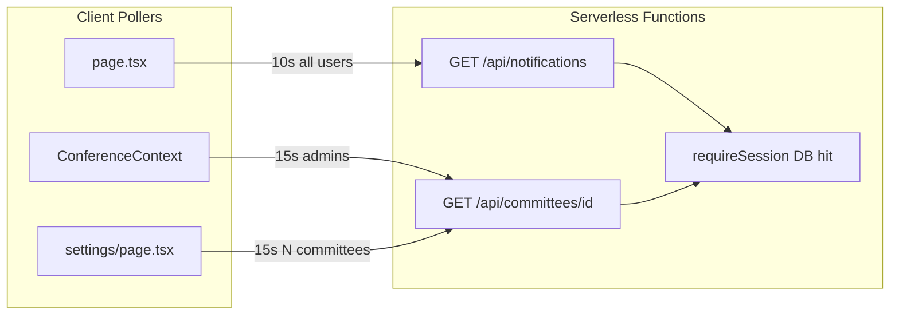
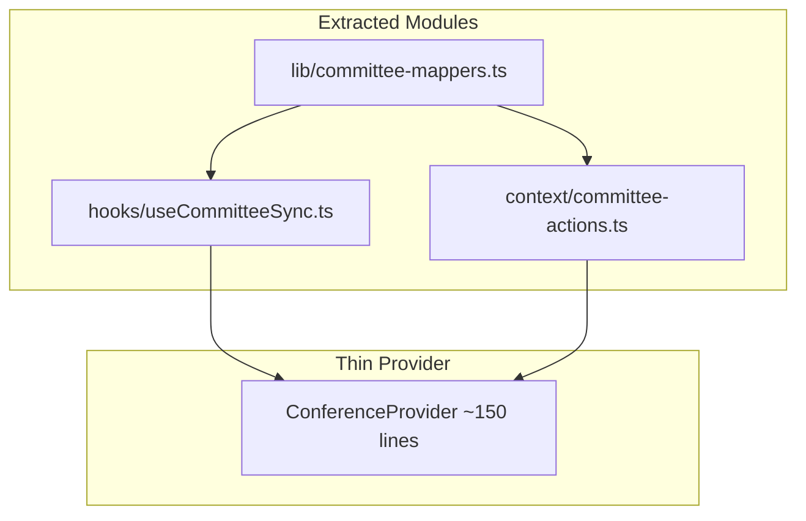

# Refactor and Reduce Vercel Requests

## Context

The app is a client-rendered Next.js 16 app where **all data flows through Route Handlers** in `[src/app/api/](panthermunc-command/src/app/api/)`. There is **no middleware** today; billable Vercel usage is driven by **serverless function invocations** on every `fetch()` to `/api/`*, amplified by:


| Source                                                                            | Interval       | Who                         | Impact                                               |
| --------------------------------------------------------------------------------- | -------------- | --------------------------- | ---------------------------------------------------- |
| `[useNotifications](panthermunc-command/src/hooks/useNotifications.ts)`           | 10s            | All logged-in home users    | ~360 req/hr/user                                     |
| `[ConferenceContext` poll](panthermunc-command/src/context/ConferenceContext.tsx) | 15s            | `committee:access_all` only | ~240 req/hr/user                                     |
| `[settings/page.tsx` poll](panthermunc-command/src/app/settings/page.tsx)         | 15s            | Admins, N committees        | N×240 req/hr (overlaps with above)                   |
| Debounced PATCH                                                                   | 300ms          | Every UI mutation           | Highly variable, full JSONB blob                     |
| `[requireSession](panthermunc-command/src/lib/session.ts)`                        | every API call | Everyone                    | DB SELECT + session save on **every** poll and PATCH |





**Your preferences (locked-in):**

- Lightweight **version polling for all committee users** (304 when unchanged; full fetch only on version bump)
- **Chair-only notification polling** at 30–60s, paused when tab is hidden

---

## Phase 1 — Request reduction (highest ROI, small diffs)

### 1.1 Version-only committee sync endpoint

Add conditional reads so polls stop transferring full JSONB payloads.

**Server** — extend `[GET /api/committees/[id]](panthermunc-command/src/app/api/committees/[id]/route.ts)`:

- Accept `?ifVersion=<n>` query param
- If `committee.version === n`, return **304** with empty body (or `{ version }` only)
- Otherwise return full committee row (current behavior)

**Bulk variant for settings** — extend `[GET /api/conference](panthermunc-command/src/app/api/conference/route.ts)` or add `GET /api/conference/versions`:

- Return `{ committees: [{ id, version, updatedAt }] }` in one request
- Settings page uses this to decide which committees need a full reload

**Client** — new `[src/hooks/useCommitteeSync.ts](panthermunc-command/src/hooks/useCommitteeSync.ts)` (extracted from ConferenceContext):

- `pollCommittee(id, knownVersion)` → 304 = no-op; 200 = merge data
- `pollAllCommittees(versionsMap)` → one versions request, then full fetch only for changed IDs
- Replace the two independent 15s `setInterval` blocks in ConferenceContext and settings with this hook

**Extend polling audience:** poll the active committee for **all users with a `committeeId`** (chairs, judges), not only `committee:access_all`. Cost stays low because most polls return 304.

### 1.2 Route-aware and visibility-aware polling

Centralize intervals in `[src/lib/sync-constants.ts](panthermunc-command/src/lib/sync-constants.ts)`:

```ts
export const COMMITTEE_POLL_MS = 15_000;
export const NOTIFICATION_POLL_MS = 45_000;
```

Add `[src/hooks/usePolling.ts](panthermunc-command/src/hooks/usePolling.ts)`:

- Pauses when `document.visibilityState === "hidden"`
- Accepts `enabled` flag based on pathname


| Route                    | Committee poll                  | Notification poll |
| ------------------------ | ------------------------------- | ----------------- |
| `/` (home)               | active committee                | chairs only       |
| `/settings`              | all committees (versions-first) | off               |
| `/admin/users`, `/login` | off                             | off               |


Implementation: read pathname via `usePathname()` in the sync hook, or split providers into an authenticated layout (Phase 3).

### 1.3 Fix settings dual-polling overlap

Remove the standalone interval in `[settings/page.tsx](panthermunc-command/src/app/settings/page.tsx)` (lines 166–173) and call `pollAllCommittees` from the shared hook instead. When on `/settings`, disable the single-committee poll in ConferenceContext to avoid duplicate work.

### 1.4 Tighten notification polling

In `[useNotifications.ts](panthermunc-command/src/hooks/useNotifications.ts)` and `[page.tsx](panthermunc-command/src/app/page.tsx)`:

- Enable only when user has `committeeId` (assigned chairs) **and** is on `/`
- Interval: **45s** (configurable constant)
- Use visibility-aware polling wrapper
- Keep `?since=` incremental filter (already implemented server-side)

### 1.5 Lighten auth on read-heavy routes

**Fix double DB hit in `[auth/me](panthermunc-command/src/app/api/auth/me/route.ts)`:** `requireSession()` already loads the user; remove the second `db.select()` and return session fields directly.

**Add `requireSession({ refresh: false })` option** in `[session.ts](panthermunc-command/src/lib/session.ts)`:

- `refresh: false` (default for GET polls / version checks): trust iron-session cookie fields, skip DB round-trip
- `refresh: true` (login, admin mutations, permission-sensitive writes): current behavior (DB verify + session save)

Use `refresh: false` in:

- `GET /api/committees/[id]` (version checks)
- `GET /api/conference` / versions endpoint
- `GET /api/notifications`

Keep `refresh: true` on PATCH/DELETE/POST and admin routes so permission revocations take effect immediately on writes.

### 1.6 Reduce write amplification

In ConferenceContext `syncCommittee` (lines 324–357):

- Increase debounce **300ms → 1000ms** (motions/timers still feel instant locally; fewer PATCHes during rapid roll-call clicks)
- Send **partial `data` patches** — the server already supports this via `[applyCommitteeDataUpdate](panthermunc-command/src/lib/committee-access.ts)`. Track last-dirty keys per save (e.g. `dirtyKeys: Set<keyof CommitteeData>`) and only include changed top-level JSONB keys in the PATCH body instead of `committeeToData(committee)` every time.

### 1.7 Small bug fixes (while touching sync code)

- `[initConference](panthermunc-command/src/context/ConferenceContext.tsx)` falls back to `POST /api/conference`, but `[conference/route.ts](panthermunc-command/src/app/api/conference/route.ts)` has no POST handler — add POST (bootstrap create) or remove the dead fallback.
- Simplify `selectCommittee` (lines 473–485): three branches all call `loadCommitteeData`; collapse to one clear path.

**Estimated impact (1 admin + 8 chairs on home for 1 hour, 8 committees):**


| Change           | Before (approx.)      | After (approx.)                                    |
| ---------------- | --------------------- | -------------------------------------------------- |
| Notifications    | 360 × 9 users         | 80 × 8 chairs                                      |
| Committee polls  | 240 full GETs (admin) | ~240 tiny 304s (all users) + occasional full fetch |
| Settings (admin) | 1,920 full GETs       | ~240 version checks + rare full fetches            |
| Auth DB per poll | every request         | skipped on reads                                   |


---

## Phase 2 — Code cleanup (maintainability, low risk)

### 2.1 Extract shared API utilities

Create `[src/lib/api/parse-json-body.ts](panthermunc-command/src/lib/api/parse-json-body.ts)` — deduplicate the identical JSON parse block in 7 route files.

Create `[src/lib/api/user-validation.ts](panthermunc-command/src/lib/api/user-validation.ts)` — share `isUserRole`, `parsePermissions`, `assertCommitteeInConference` between admin user routes.

### 2.2 Extract shared client guards

- `[src/hooks/useRequirePermission.ts](panthermunc-command/src/hooks/useRequirePermission.ts)` — replaces duplicated redirect + loading guard in `[settings/page.tsx](panthermunc-command/src/app/settings/page.tsx)` and `[admin/users/page.tsx](panthermunc-command/src/app/admin/users/page.tsx)`
- Move `ConferenceStatsCard` / `NotifyChairsCard` from settings into `[src/components/settings/](panthermunc-command/src/components/settings/)`

### 2.3 Split large UI files (no behavior change)


| File                                                                                            | Lines | Extract to                                                        |
| ----------------------------------------------------------------------------------------------- | ----- | ----------------------------------------------------------------- |
| `[MotionActiveSession.tsx](panthermunc-command/src/components/motions/MotionActiveSession.tsx)` | 719   | `TimerControls.tsx`, `SpeakerQueue.tsx`, `VotingSpeakerQueue.tsx` |
| `[MotionPanel.tsx](panthermunc-command/src/components/motions/MotionPanel.tsx)`                 | 424   | `MotionFieldRenderer.tsx`                                         |
| `[admin/users/page.tsx](panthermunc-command/src/app/admin/users/page.tsx)`                      | 418   | `UserCreateForm.tsx`, `UserRow.tsx`                               |
| `[page.tsx](panthermunc-command/src/app/page.tsx)`                                              | 302   | `AdminSetupScreen.tsx`, `VoteThresholds.tsx`                      |


### 2.4 Remove dead code


| Item                                                  | Location                                                                       |
| ----------------------------------------------------- | ------------------------------------------------------------------------------ |
| `PANTHER_PURPLE` (unused)                             | `[constants.ts](panthermunc-command/src/lib/constants.ts)`                     |
| `password.ts` (unused SHA helpers)                    | `[src/lib/password.ts](panthermunc-command/src/lib/password.ts)`               |
| `canEditScoring` (never called)                       | `[permissions.ts](panthermunc-command/src/lib/permissions.ts)`                 |
| `managementPasswordHash` (never used)                 | `[types.ts](panthermunc-command/src/lib/types.ts)`                             |
| `computeMotionDisruptivityFromMotion` (unused export) | `[motion-disruptivity.ts](panthermunc-command/src/lib/motion-disruptivity.ts)` |


### 2.5 Consolidate duplicated domain logic

- Unify `Notification` / `NotificationItem` types into `[types.ts](panthermunc-command/src/lib/types.ts)`
- Add quorum helpers to `[rollcall.ts](panthermunc-command/src/lib/rollcall.ts)` (`countPresent`, `countPresentVoting`) and use in `[conference-stats.ts](panthermunc-command/src/lib/conference-stats.ts)`, ConferenceContext, and `VoteThresholds` in page.tsx
- Extract shared `[CommitteeForm](panthermunc-command/src/components/committees/CommitteeForm.tsx)` from setup screen + Header "Add Committee" form

---

## Phase 3 — Decompose ConferenceContext (structural refactor)

The 915-line `[ConferenceContext.tsx](panthermunc-command/src/context/ConferenceContext.tsx)` is the main architectural debt. Split without changing the public `useConference()` API initially (minimize churn in 15+ consumers).




1. `**src/lib/committee-mappers.ts**` — `committeeToData`, `rowToCommittee`, `emptyCommitteeStub`, `DbCommitteeRow`
2. `**src/hooks/useCommitteeSync.ts**` — load, save, debounce, version map, polling (from Phase 1)
3. `**src/context/committee-actions.ts**` — pure mutation helpers taking `(committee, args) => committee` for delegates, motions, scoring, etc.
4. **Thin provider** — wires state + sync hook + action dispatchers; expose stable callbacks via `useCallback` to limit re-renders

**Optional follow-up:** split `useConference()` into `useConferenceState()` + `useConferenceActions()` or adopt `useReducer` so mutation methods don't recreate the entire context value on every state change.

### Authenticated layout split

Move `ConferenceProvider` out of root `[layout.tsx](panthermunc-command/src/app/layout.tsx)` into a new `[src/app/(app)/layout.tsx](panthermunc-command/src/app/(app)`/layout.tsx) route group wrapping `/`, `/settings`, `/admin/`*. Keep `/login` outside so it doesn't load conference sync code or trigger conference fetches.

Rename DB type `Committee` in `[schema.ts](panthermunc-command/src/db/schema.ts)` to `CommitteeRow` to avoid collision with domain `Committee` in `types.ts`.

---

## Phase 4 — Optional future (not in initial scope)

- **Persist notifications in Postgres** (new `notifications` table) — fixes unreliable in-memory store across Vercel serverless instances; only needed if notification delivery proves flaky after Phase 1
- **SSE endpoint** for conference sync — eliminates polling entirely for active sessions; higher complexity, revisit if request volume is still too high after Phases 1–3

---

## Suggested implementation order

1. Phase 1.5 (auth lighten) + 1.1 (version GET) — immediate per-request savings
2. Phase 1.2–1.4 (shared polling hook, settings overlap fix, notifications)
3. Phase 1.6–1.7 (partial PATCH, debounce, bug fixes)
4. Phase 2.1–2.2 (API + guard utilities) — do alongside Phase 3 prep
5. Phase 3 (ConferenceContext decomposition + authenticated layout)
6. Phase 2.3–2.5 (UI splits, dead code, domain consolidation) — as files are touched

## Verification

- Manual: two browsers (chair + registrar) on same committee — chair sees registrar's roll-call change within one poll cycle; most polls show 304 in Network tab
- Manual: admin on `/settings` — only one polling mechanism; version check returns 304 for unchanged committees
- Manual: chair on home — notification poll every ~45s; admin on home — no notification poll
- Manual: rapid roll-call toggles — fewer PATCH requests than before (debounce + partial payload)
- `npm run build` passes; no regressions on login, committee switch, 409 conflict recovery

