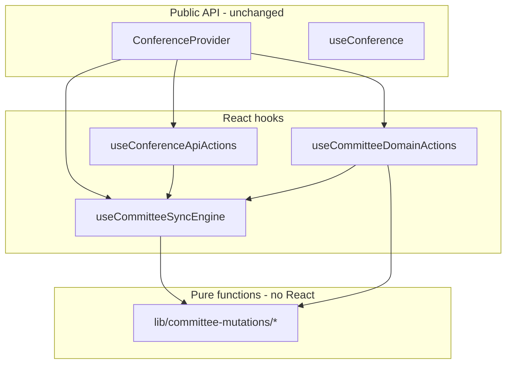

# Split ConferenceContext (internal modularization)

## Problem

[`ConferenceContext.tsx`](panthermunc-command/src/context/ConferenceContext.tsx) (~1000 lines) mixes three concerns:

| Layer | Responsibility | ~Lines |
|-------|----------------|--------|
| Sync kernel | load, poll, debounced PATCH, dirty-key tracking, version conflict handling | 150–385 |
| Conference CRUD | init/update/delete conference, create/remove/select committees, settings | 396–573 |
| Domain mutations | delegates, roll call, motions, documents, speaking, points, scoring | 579–944 |

All 40+ methods are exposed on one flat `ConferenceContextValue` interface. Sixteen components import `useConference()` and destructure only what they need, but the provider still owns everything in one file.

A prior commit ("split ConferenceContext") optimized polling/API usage but did **not** split the file — the god object remains.

## Strategy

Keep the public surface unchanged:

- `ConferenceProvider` stays in [`(app)/layout.tsx`](panthermunc-command/src/app/(app)/layout.tsx)
- `useConference()` returns the same flat object
- **No consumer file changes** in this pass

Decompose **internals only** into three layers that mirror how the code already works:



---

## Layer 1: Pure committee reducers

Extract state-transition logic into [`src/lib/committee-mutations/`](panthermunc-command/src/lib/committee-mutations/) as pure functions:

```ts
// (committee: Committee, ...args) => Committee
export function addDelegate(committee, country, delegateName, ppStatus): Committee
export function archiveMotionQueue(committee, passedMotionId): Committee
// etc.
```

**Group by domain** (one file each):

- `delegates.ts` — add/update/remove delegate (+ rubric score stubs)
- `roll-call.ts` — start session, update attendance/quorum
- `motions.ts` — add/update motion, session-state setters, `archiveMotionQueue` (the most complex reducer — ~70 lines)
- `documents.ts` — add/update/promote
- `speaking.ts` — `addSpeakingEvent`
- `points.ts` — add/resolve
- `scoring.ts` — rubric scores, sign, position papers, VC recipient

These functions contain the **business logic currently inside `patchCommittee` callbacks**. They are trivially unit-testable (no tests exist today, but this unlocks that later). `uuidv4()` and `new Date().toISOString()` stay in the action wrappers (thin hooks), not the pure reducers, so reducers stay deterministic given inputs.

---

## Layer 2: Sync engine hook

New file: [`src/context/conference/useCommitteeSyncEngine.ts`](panthermunc-command/src/context/conference/useCommitteeSyncEngine.ts)

Owns all shared infrastructure currently in the provider:

- State: `conference`, `activeCommitteeId`, `loading`, `conferenceUnavailable`, `syncError`
- Refs: `conferenceRef`, `versions`, `dirtyKeys`, `saveTimers`
- Effects: initial load (auth-gated), active-committee polling via [`usePolling`](panthermunc-command/src/hooks/usePolling.ts)
- Core methods: `loadCommitteeData`, `loadAllCommitteeData`, `syncCommittee`, `scheduleSave`, **`patchCommittee`**, `requireCommittee`
- Derived: `activeCommittee` memo, `clearSyncError`

Returns a typed `CommitteeSyncEngine` object that downstream hooks consume. This is the **only** place that calls `setConference` for committee-data patches.

---

## Layer 3: Action hooks

### Conference-level API — `useConferenceApiActions.ts`

Wraps fetch calls that touch conference metadata or committee rows directly (not via `patchCommittee`):

- `initConference`, `updateConference`, `deleteConference`
- `createCommittee`, `selectCommittee`, `removeCommittee`
- `updateCommitteeSettings` (special PATCH with name/topic/type)
- `updateCommittee` (full replace via `patchCommittee`)
- `loadAllCommitteeData` (re-exported from sync engine)

### Domain actions — `useCommitteeDomainActions.ts`

Single hook that binds all domain mutations to `patchCommittee` + `requireCommittee`:

```ts
const addDelegate = (country, name, ppStatus) => {
  const cid = requireCommittee();
  patchCommittee(cid, (c) => delegateMutations.addDelegate(c, country, name, ppStatus));
};
```

Keeps the flat method names the context already exposes.

---

## Layer 4: Thin provider + types

New directory: [`src/context/conference/`](panthermunc-command/src/context/conference/)

| File | Role |
|------|------|
| `types.ts` | `ConferenceContextValue` (unchanged shape); optional internal sub-interfaces (`CommitteeSyncEngine`, `ConferenceApiActions`, `DomainActions`) for hook typing |
| `ConferenceProvider.tsx` | ~40 lines: compose hooks, `useMemo` merge into context value |
| `index.ts` | Re-export `ConferenceProvider`, `useConference` |

[`ConferenceContext.tsx`](panthermunc-command/src/context/ConferenceContext.tsx) becomes a one-line re-export shim (or is deleted with import paths updated in layout only):

```ts
export { ConferenceProvider, useConference } from "./conference";
```

This avoids touching 16 consumer import paths if the shim stays at the old path.

---

## What we are explicitly NOT doing

Per your scope choice:

- No new `useDelegateActions()` / per-domain consumer hooks
- No multiple nested React contexts (state vs actions) — the shared `patchCommittee` kernel makes this awkward and it does not reduce file complexity
- No state-library migration (Zustand, etc.)

---

## Implementation order

1. Create `lib/committee-mutations/*` — move reducer logic out, verify identical behavior
2. Extract `useCommitteeSyncEngine` — move refs, effects, `patchCommittee`; provider temporarily imports both old and new to validate
3. Extract `useConferenceApiActions` and `useCommitteeDomainActions`
4. Replace provider body with composition; keep identical context value keys
5. Add re-export shim; run `tsc --noEmit` / dev smoke test

---

## Risk notes

- **Behavior parity**: `archiveMotionQueue` and `updateCommitteeSettings` have the most branching — copy verbatim first, refactor only structure
- **Ref stability**: action hooks should wrap handlers in `useCallback` keyed on `patchCommittee` / `requireCommittee` (already stable via `useCallback` in sync engine) to avoid unnecessary context value churn
- **Dirty-key tracking** stays in `patchCommittee` only — pure reducers must not touch `dirtyKeys`

## Success criteria

- `ConferenceContext.tsx` (or its replacement) under ~80 lines
- No changes to any component under `src/components/` or `src/app/`
- `useConference()` return type unchanged
- Largest individual new file under ~200 lines (motions mutations)
